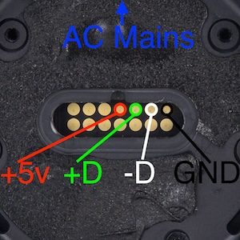

# Simple HomePod USB / UART Adapter (WORK IN PROGRESS)
This is a forked / modified repo of el1ng's and tihmstar's homepod adapters. I've only made minor tweaks to the adapters, and refocused the README

## You Will Need
* 4x M2x6 screws; to screw the adapter plate to the bottom of the homepod. You can tape it down if it is secure. The point is a SECURE connection. The screws that hold the circular plastic frame on top of the logic board work perfectly if you have any spares.
* Pogo pins / test probes (P75-B1 or P75-E2)
* USB cable to solder to test probes
* If using UART, spare wire to solder to UART test probes


# Making It
I hosted a livestream making some adapters if you want some visual reference, not really a guide: https://www.youtube.com/watch?v=fxdIzLTcSnA

Download the .stl file depending on which probes you can get / have, load it into your preferred slicer, with the homepod side of the dongle facing up, and with support. Then print it!

The pinout of the HomePod's debug port, with the pod upside down, and you looking down at the port, is as follows:

```
                AC PORT
                  ^
                  
| NC | TX | RX | CTRL | D+ | D- | GND |
| NC | NC | NC | GND  | NC | NC | NC  |
```


For USB and restoring software, you only need four probes connected to +5v, D+, D-, GND. 

For UART, you need two more probes on the TX and RX, and one for GND. You can share the same GND from the USB line, or another marked GND pad, all the GND pads are internally connected. 
 
For the B1 probes, to avoid melting the 2d printed plastic adapter, solder wires to the pins, _then_ insert them into the adapter. Make sure they have a good solder connection, otherwise the USB connection will be very unstable or will not work at all.

If you're using the E2 probes, you won't be able to fit the probbes in with wires attached, so you'll have to insert the pins into the adapter first, then solder the wires onto them. Minimize the amount of time you are heating the pins to avoid melting the plastic adapter


# Using It

You can use this adapter to restore a software bricked first generation HomePod via the restore guide: https://github.com/UnbendableStraw/homepod-restore/

You can also look at the UART console to possibly identify hardware failures preventing the software from operating. To do so;
1. Find your USB UART adapter's address with

`ls /dev/cu.*`

2. "Screen" into your adapter (probably using baud rate 115200) with this, where `tty.usbserial-1` is the adapter you got from the previous command

`screen /dev/tty.usbserial-1 115200`

Tip: You can output your UART logs to a file while still being able to see the logs as they happen. After you enter your screen command, hit control-a, then H. It will output a screenlog.0 file you can rename to .txt

# Warning

If the wrong pins on your adapter touch the wrong pads on the homepod while there is power, it can cause hardware damage. Avoid by simply disconnecting power and usb from pod before removing the adapter from pod.

